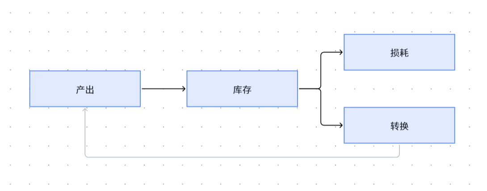
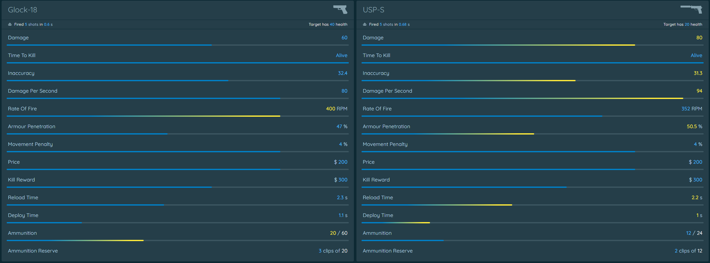
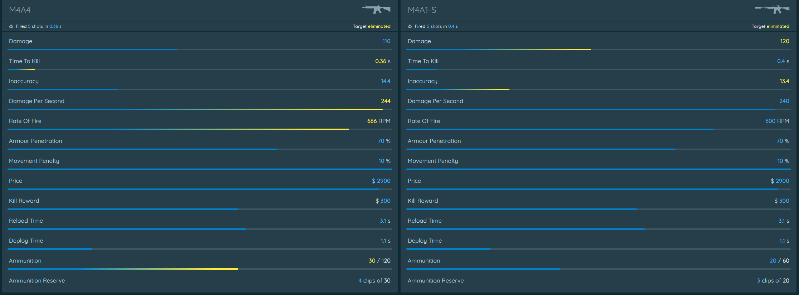
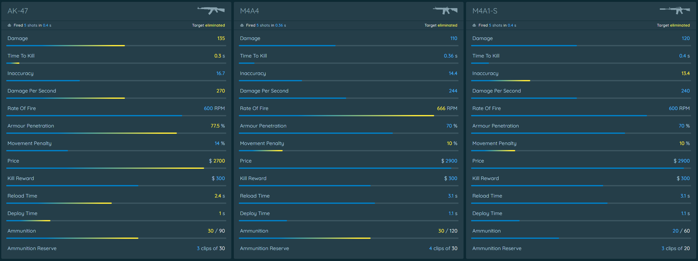

---
title: "针对《CS2》的战斗体验与对抗博弈的多系统拆解"
date: 2026-5-18 13:00:00 
tags: [游戏设计，拆解]
categories: [游戏设计，游戏拆解]
--- 
* 本文从经济、场景、武器等系统，拆解经久不衰的CS系列如何营造为人称赞的FPS游戏体验，并构建一套精密而高效的博弈体系。

<!-- more -->
## 针对《CS2》的战斗体验与对抗博弈的拆解
### 一、前言
#### 写在前面

自从接触游戏设计与游戏开发以来，笔者花费了大量的时间与精力在理论知识的学习与Game jam的实战演练中（*~~当然，还有不少时间与精力被笔者用来玩游戏了~~*）。一直以来，笔者都希望能有一个契机停下脚步，复盘回顾自己在学习与演练的过程中积累的经验，并对某些行业与玩家公认的优秀作品进行剖析学习。但囿于急功近利的心态，笔者一直没有下定决心空出一段时间来进行沉淀，直到最近开始参加腾讯的 “开局一课”，需要以大作业的形式提交一份游戏拆解，笔者终于找到了这样的契机，希望可以利用自己的经验与知识储备，完成一次针对优质游戏作品的拆解，也算是对个人能力的一次检验（*~~果然还是要吃点压力才能下定决心吗~~*）。正如标题与简介所言，这次的游戏拆解将从多个系统出发，对CS系列（主要是CS2）的战斗体验与对抗博弈进行拆解。

为什么笔者在进行自己的第一篇游戏拆解时，选择了“反恐精英”？这就要牵扯到笔者小时候蹲在老爹电脑前旁观老人家玩游戏的经历了。在笔者尚且年幼时（*应该是四五岁吧，真的很年幼了*），对游戏的一般认知还停留在3366或4399上各种网页flash游戏，那时笔者所接触过唯一一款流程时长大于一个小时的游戏只有《植物大战僵尸》（*还是老妈带我玩的*）。而在老爹的电脑上有这么一款游戏，玩家可以扮演特警军队，手持各种长短枪械，在各种风格的地图里畅爽对射，这简直是每一个四五岁男孩所能想到的最帅的事情。因此，那时笔者最期盼的事情就是每天晚上蹲在老爹电脑旁边，看着他打上几小时的CS（*按照笔者的印象，那时候老爹玩的应该仍然是CS1.6。当然，那时候老爹还玩剑网三，但笔者那时候太小看不懂，每次都催老爹去玩CS，不知不觉中就失去了对MMORPG的兴趣，直到现在也对这类游戏不太感冒*）。后来，笔者在小学有了自己的平板电脑，受到老爹与CS的影响，逐渐开始接触刚刚起步不久的移动端FPS，也在当时的Bilibili上围观各种端游的FPS（*挺自豪的嘿嘿，笔者四年级就开始用Bilibili，那时候甚至还可以在B站看哲♂学*），甚至还能在家里的老笔记本上玩六十多帧的《生死狙击》（*黄埔军校这一块*）。直到初中笔者拥有了第一台手机，也逐开始渐接触到《PUBG mobile》、《COD mobile》等优秀的手游FPS游戏作品，这时笔者才算是真正成为了一名FPS骨灰级玩家。高中学业繁忙，笔者的游戏时间相当有限，但到了大学，笔者终于拥有了自己的电脑，于是可以接触更多玩法更丰富、画面更精细、玩家社区更活跃的端游作品。笔者依稀记得自己的第一款电脑游戏是《赛博朋克2077》，第二款就是彼时上线不到一年的《CS2》。

闲话说了那么多，只是为了铺垫这款游戏对于笔者的启蒙意义，从个人情感上说清笔者为什么要选择《CS2》作为这次拆解的对象。此外，笔者选择拆解《CS2》的战斗体验与博弈对抗，还因为反恐精英系列作为对抗FPS类网游的标杆，其战斗体验与博弈平衡的设计思路非常值得FPS方向的战斗策划（*也是笔者的Dream Job*）学习。尽管以现在的眼光来看，《CS2》没有丰富的玩法机制，没有广袤的开放地图，没有复杂的角色技能，但正可谓“旧书不厌百回读”，笔者将尝试在这次拆解中阐清这一 “FPS历史上最高的山” 为什么得以成为电子游戏史上的经典。

#### 1.1. 拆解思路
**笔者的拆解对象主要是《CS2》的战斗体验与对抗博弈，这听上去不满足于“开局一课”大作业中“从某一个方向进行拆解分析”的要求。** 为此，笔者在这里补充一句：粗略来说，笔者最初本意欲拆解《CS2》的战斗系统，但考虑到《CS2》的战斗系统几乎与其对抗与博弈的游戏目标融为一体（*而且V社在这部分的设计其实也非常精妙*），笔者认为最好围绕游戏中关于对抗与博弈的设计进行拆解。而这，又会无可避免地引出关卡设计、局内经济等深度服务于对抗博弈目标的系统的作用与影响，以及这类系统与笔者最初准备着重拆解的战斗系统本身的交互，这也正如所有的设计学课程都会强调的：“系统之间不是彼此独立的，设计者往往要考虑到系统之间的互动”，对于这类核心玩法体验久经考验、极为凝练的作品，笔者认为尤其如此。**因而笔者可能将以针对对抗博弈的机制设计的拆解为核心，在拆解中涉及到对《CS2》多个系统的拆解**（*Bro还在叠甲*）。

~~为了防止阅卷老师没有注意到这一句关键叠甲，在这里引用一下上面的文字：~~

    因而笔者可能将以针对对抗博弈的机制设计的拆解为核心，在拆解中涉及到对《CS2》多个系统的拆解

但是话又说回来了，为了满足题目“一个方向”的要求，在围绕对抗博弈的游戏目标，对多个游戏系统展开拆解的过程中，笔者也会着重强调游戏的战斗系统设计（*也是笔者期待中的求职方向*），这也就是为什么这篇文章的名字里多了“战斗体验”四个字，~~球球阅卷的老师高抬贵手不要判我走题。~~

### 二、利用MDA框架粗解《CS2》的设计结构
    关于MDA框架、FDD框架、分层四元法的相关内容，可移步笔者的这一篇博客：
    https://nandcpointfm.github.io/2026/03/31/DaoLun8/
    在本文第二部分，拆解的对象不是单一系统，而是《CS2》作为一款游戏的整体。对于具体的系统的分析在后文呈现，而关于对抗博弈的分析将在对相关系统的拆解尽数完成后进行。
#### 2.1. A：美学（Aesthetics）
当我们讨论一款游戏的美学设计，我们所聚焦的应当是设计者预期游戏动态所能唤起的玩家情绪体验。不妨以玩家身份代入思考，我们在《反恐精英》系列里到底体验到了什么？是什么感受让玩家痴迷于这款游戏？

作为一款对抗类网络游戏，玩家所期待实现的目标往往是两个：

* **在游戏中利用自己的意识与操作击败（消灭）对手。**
* **赢得游戏的胜利。**

而MDA框架给出了九种美学，它们分别是：
* 感知（Sensation）：游戏作为感官愉悦，玩家从视听、触觉反馈中获得享受，如《节奏天国》《战神》系列、音游。 
* 幻想（Fantasy）：游戏作为虚构世界，玩家沉浸在架空的世界观与想象中，如《原神》《最终幻想》系列、《艾尔登法环》。
* 叙事（Narrative）：游戏作为戏剧，玩家跟随跌宕起伏的故事推进，获得情感共鸣，如《最后生还者》《底特律：变人》《去月球》。 
* 挑战（Challenge） 游戏作为障碍课程，驱动玩家掌握技巧、突破难关，获得成就感，如《黑暗之魂》系列、《杀戮尖塔》、竞技类 FPS。 
* 交际（Fellowship） 游戏作为社交框架，玩家在合作、社群互动中获得归属感，如《魔兽世界》《Among Us》《双人成行》。 
* 探索（Discovery） 游戏作为未知领域，玩家在探索世界、发现隐藏内容中获得新鲜感，如《塞尔达传说：旷野之息》《无人深空》。 
* 表达（Expression） 游戏作为自我探索，玩家通过创作、个性化定制留下个人印记，如《模拟人生》《我的世界》《动物森友会》。 
* 忘我（Submission） 游戏作为消遣，玩家无需高强度思考，轻松投入、打发时间，如《开心消消乐》《沙漠高尔夫》、放置类游戏。 
* 竞争（Competition） 游戏作为零和博弈，玩家在与他人的对抗中追求胜利与排名，如《英雄联盟》《CS2》《星际争霸》。

不难发现，其实《CS2》主要给予玩家的美学体验是：
* 感知：通过游戏视听、开火手感、击杀反馈，玩家在激烈的枪战体验中得到感官上的直接刺激。心理学认为人有本能的破坏欲与创造欲，而CS系列优秀的感知体验满足了玩家泼洒火力的破坏欲。

* 挑战：玩家在提升自己、克服强敌的过程中完成了挑战，获得了强烈的成就感。在单局内，玩家在一场你死我活的对枪中消灭了强劲的敌人，或是完成了游戏的落后追平甚至逆风翻盘，这是一种克服挑战的乐趣；而在长期的成长过程中，玩家的反应、枪法（*定位、压枪*）、意识（*走位、预瞄，全局思维*）等方面的成长让玩家获得了更高的分数（*或者段位，比如完美平台段位或者5E段位，还包括国外的Faceit段位*），这也是克服挑战的乐趣。克服挑战的过程刺激玩家大脑释放内啡肽（*这也是“开局一课”的老师所提到过的*），从而形成对游戏的长期粘性。

* 交际：玩家以游戏为载体进行社交，甚至形成了社交圈子。一方面，玩家在CS系列中被鼓励交流，每次匹配到的队友都可能碰撞出不同的火花，这种游戏内的临时社交一定程度上弥补了玩家现实生活中的社交缺口。另一方面，CS系列很大程度上适配基友开黑的场景，进一步满足了玩家以游戏进行社交的需求。

* 竞争：作为一款以玩家竞技对抗为核心的游戏，竞争是游戏的重要组成部分。CS在一局游戏中有最少13轮竞争，为玩家提供了有深度的竞争空间。此外，游戏优秀的对抗博弈设计（*后面会提到*）鼓励玩家竞争，并给予玩家很好的正反馈体验。而竞争的结果被局内PBL（*计分板*）与长线PBL（*平台的段位 / 官匹分数*）系统记录、评估（Rating / WE，当然，还包括某些启动平台自带的更深入的数据分析）、排名，让玩家能清晰地从竞争结果中获得成就感，并在未来明确提升竞争能力的方向。

#### 2.2. D：动态（Dynamics）
当我们完成对《CS2》美学的拆解，再把目光转移到是怎样的动态激发了这样的美学。可以认为，《CS2》的关键动态非常精简：
* 玩家战术的涌现，包括经济管控（*Eco、Semi-Eco、Force-Buy、Full-Buy*）道具的使用（*闪、烟、火、雷*）、开局分路的决策（*如CT方谁负责防守哪里，或是T方打哪个点*）、推进战术的节奏（*如提速、慢打、rush等*）与彼此之间的配合（*补枪、架枪线、道具配合等*）。
* 在实现上述战术安排的过程中，玩家与敌人之间进行对枪。

对这样的关键动态进行拆解细分与内容扩充，我们得到：

1. **回报动态：**

* 对于任意一支队伍，Eco/Force-Buy/Full-Buy的选择往往存在周期循环。胜队倾向于全起（full buy）以保持优势，而败队时常因经济落后而被迫eco（存钱）、semi（半买）、force（强起），在重复的单局中涌现出队伍资源的差距，并进一步涌现出更多的队伍策略。

* 队伍存在失败的崩盘风险。连胜往往会使得队伍积累起经济优势，但一次失误可能就将引发eco snowball——输队多回合eco而在对局中陷入劣势，从而更频繁地输掉对局。

2. **时空动态：**

* 信息不对称与阵营之间的推挤是CS对抗的核心。T的进攻需要烟、火、闪辅助进攻、清除死角、分散注意力；CT的防守则依靠守点、轮换和预瞄来维持图权的控制。在CT与T的拉扯与推挤过程中，形成了丰富的对局动态，我们可以通过2D俯视角的demo回放清晰地看见这样的动态涌现。

* 地图设计鼓励多路线博弈（A、B、中路），并设置关键区域（如米垃圾的VIP位）。T方需要制定决策，定好人员分路，依靠人数优势（*比如T选择Rush B，而B不可能有五个CT在防守，因为其他点位也需要有人防守*）主动寻找多打少的占优对位，而防守方需要依赖防守的架枪与站位的先手优势，分配力量防守不同的分路，力求获取信息、维持图权，并为队友回防营造时间窗口。而对于关键区域（VIP区域），任何一方控制VIP都可以极大改变游戏的节奏与胜负倾向，便于己方玩家在不同的分路之间灵活流动。多路线设计为游戏的对抗提供更多可能与不确定性的同时，也引导玩家做出更多富有差异的风险-收益博弈。

* 丰富的道具与道具特殊规则营造了对局的差异性与博弈深度。例如烟雾可被射击/穿透/短暂清除，让烟幕从单一的静态阻挡变成一定时空范围内的博弈变量。譬如，T方可利用烟雾遮蔽敌人视野从而安全进攻，或是混烟消灭潜在的威胁。CT方可利用烟雾掩护反推或拖延时间等待队友回防。技艺精湛的射手可以用手雷炸开烟幕的遮挡，并在烟雾重新弥散前的短暂一瞬完成击杀。此外还有燃烧瓶、闪光弹、手雷、~~电击枪~~等道具，也有自己的特殊规则，带来了游戏的博弈深度（*这部分内容会在后面战斗系统拆解里详细阐释*），同时增加了时机窗口（timing）的涌现。

* 前半回合（pre-plant）中，两方往往进行缓慢的信息收集与默认部署，而后半回合（post-plant）是高强度对抗的时间。这样自发形成的一般动态形成了对局体验的起伏，每一局中玩家的肾上腺素浓度都在随着时间进行逐步上升，让游戏的体验更加刺激。

* CS2较于前作更精确的移动让“peek”“急停”等身法动态更具技巧深度，这使得玩家对游戏的精通成本变高，与枪法、意识等层面的能力梯度一起拉开了玩家之间的水平差距，给与了深度玩家更多的提升空间。

3. **协调动态**

* 对于专业的队伍，往往存在一个指挥来制定宏观策略，而队员执行微观操作。而对于一般的玩家，团队的取胜也无法离开战术的讨论、部署，与信息的搜集、传递。这一过程极大依赖团队的默契协作与良好的队内沟通。缺少经过慎重思考的决策往往会使得队伍缺少应变能力与战术深度，而沟通的延迟或误判也可能导致队伍的信息劣势，这都将使得团队陷入不利的境地。

* 适应性的meta策略体现了《CS2》决策动态涌现，这是强竞技属性的一种表征（也就是团队针对主流策略趋势与当前对手的习惯开发特定战术）。对手习惯被针对后，其动态又转向反meta，形成新的适应性meta策略。一个很典型的例子是Majors中读书（scouting）带来的策略进化。

* 残局1vN是一种极端情形下的动态。单个玩家在时间压力、战力劣势、信息劣势的不利情景下，克服其爆炸式扩展的决策选择，实现残局翻盘，产生高光时刻。这类奇迹时刻的存在让玩家相信哪怕是1V5的劣势局面也可以被出色的操作Carry，很好地为游戏提供了悬念，同时也增强了游戏的观赏性与玩家群体的期待感。

4. **整体节奏**  

* 回合内，游戏为玩家提供了紧张-松弛的交替，例如在游戏早期部署或中期存活玩家数变少时，游戏存在相对平静的松弛时期，而当玩家与敌人接触并展开激烈对决时，紧张感将随着交火烈度陡然上升。

* 回合间，存在玩家心理的恢复期，15s倒数与最长数分钟的暂停允许队伍复盘与调整。

**从上述拆解，我们可以进一步将游戏动态回归为玩法规则。接下来笔者将从不同系统的规则与系统间的交互来阐释MDA框架的最后一部分——机制（Mechanics）。这里笔者着重从经济系统、关卡设计、战斗系统出发，分析这些系统如何构成了游戏出色的游戏体验，并形成优秀的博弈平衡。**

### 三、从《CS2》的机制（Mechanics）设计分析其主要系统的组成与效用
#### 3.1.经济系统

我们先简单分析任意一款游戏中经济系统的一般组成：

如图所示，一个经济系统大致可以拆解为产出、库存、损耗以及转换。

* 产出：产出是某种资源的来源渠道或获取方式。常见的产出端口包括敌人掉落（*如战利品或货币，当然还包括经验*）、贸易交换（*比如商店内购买*）、场景搜集（*比如搜打撤或大逃杀的资源搜集，或者某些开放世界游戏的可搜集资源*）等。产出的设置可以有效引导玩家的游戏行为，比如玩家会为了获取（*某种*）凋落物而反复刷（*某种*）怪，或是会为了获得某种散落在地图中的资源而探索整个世界。某种程度上，转换（*参见后文*）也算是一种资源产出，因为转换也是资源的来源之一。

* 库存：库存是玩家对某种资源的积累池。常见的库存节点包括物品栏、背包或是仓库，也可以是一个计数器（*比如剩余弹药、货币数量*）或是某项数值的Bar（*比如很多游戏的屏幕边角上的血条 / 蓝条*）。限制库存（*比如负重限制或是空间限制*）可以有效的为玩家营造资源管理的挑战，并迫使玩家恰当地使用这些资源（*试想战斗策划组费尽心力设计的最终Boss被玩家用数百瓶血药硬通了——只要没有限制，笔者就很喜欢做这种事情*）。

* 转换：一些资源其本身没有效用价值（*比如货币，它就在背包里躺着，仅此而已*），但可以通过转换变成其他有价值的资源。转换代表着资源之间按照某种规则进行转化，而这种变化的发生一般是对玩家有利的。利用货币购买各类资源，或是使用搜集到的材料打造更好的装备，都是转换的过程。转换的设计影响着游戏的节奏，也关联着玩家的成长。从游戏节奏上，如果我们可以计算转换的比例，就可以知道多少底层资源可以通过转化，实现玩家的某种游戏目标（*这其实也关联到玩家成长，比如打多少只怪可以升级——玩家成长经验曲线的设计也会影响游戏节奏*）；而从玩家成长上，给玩家制造一些两难困境，可以有效引发玩家对资源管理、成长路径的斟酌，并引导玩家（*甚至社区*）寻找最优的路径（*当然，策划在设计时希望避免出现明显的最优路径，但是鼓励玩家们试图寻找最优解的尝试*）。比如同样的铁玩家是优先制作一把剑还是打造一副铠甲？同样一个技能点玩家是加点单手武器技能还是加点双手武器技能？这都是可以交给玩家的决策深度。

* 损耗：在一些情况下，资源会被消耗。不同于转换过程的消耗，损耗的消耗往往并不表现为一个对玩家有利的过程。比如被玩家打出的子弹，如果没有命中敌人，那么它就无法转换成任何其他资源或收益（*若击中敌人，降低了敌人的HP，则玩家其实是存在正收益的*）。一些生存类游戏中的耐久值被消磨的过程也可以算作损耗（*这是之前自学相关课程时主讲人举的例子，但笔者其实怀疑这一说法，比如玩家持有某种耐久有限的道具，玩家在游戏中消耗其耐久的过程其实也可以看作是将其耐久度转换为一种“能力” / “权限”的过程。比如，在MC中只有用钻石镐才可成功开采黑曜石，那合成钻石镐并用于开采黑曜石，是不是可以理解为将三个钻石转化成“得到黑曜石的权限”呢？笔者假设这样的消耗并不算毫无意义的消耗，在消耗过程中它一定程度上是对玩家有利的。*）。损耗的存在客观鼓励了玩家积极地花更多的时间体验游戏内容，并在游戏中试图弥补损耗或替补损耗的资源。这种设计往往可以减缓玩家的成长，从而实现调控游戏节奏的作用。

现在，我们再列出《CS2》的经济规则并进行分析：
* 基本规则：
    * 经济以货币为载体，货币不被带出局内，且仅在局内根据队伍表现发放。
    * 货币在每一轮次开始时可以用于购买枪械 / 护甲 / 道具。

    为了方便后续讨论，我们加入一段针对CS系列经济术语的简述，其内容由AI生成。

> 在CS2中，经济系统是游戏最核心的策略层之一，玩家常用“XX起”来描述不同经济状况下的购买策略，这些术语共同构成了比赛的节奏与博弈深度：
> 
> * 全起（Full Buy）：队伍经济充裕时，全员购买顶级步枪（AK-47/M4系列）、全套护甲和大量Utility的最高配置。这是双方全力以赴的“步枪局”，也是比赛中最具策略深度和观赏性的阶段。
> 
> * 半起（Semi-Buy / Half Buy）：经济处于中间水平时，购买次级步枪（如Galil、FAMAS、AUG、SG 553）或部分主力武器，属于保留战斗力同时为后续回合蓄力的折中方案。
> 
> * 强起（Force Buy）：经济明显劣势却不愿纯存钱时，强行购买冲锋枪（如MAC-10、MP9）或低配步枪进行反击，属于高风险高回报的赌博式打法。
> 
> * 轻起 / 小起（Light Buy）：比强起更保守的购买策略，只购买少量武器或手枪，试图以最低成本保留一定威胁，同时为下一回合保存更多资金。
> 
> * Eco（Eco Round / 纯Eco）：经济严重不足时，队伍选择大量存钱（Save），仅购买极少量武器甚至完全不买，目标是牺牲当前回合，为下一回合积累足够资金实现全起。
> 
> * Anti-Eco（反经济局）：当预测对手在Eco或强起时，自己选择全起或半起进行强势压制，试图通过装备优势快速扩大经济领先。

* 产出：  

        首先需要明确，这里的产出拆解仅包含游戏中货币的产出，至于弹药、血量等自动补充、相对独立的产出，不在本部分提及。
    * 击杀敌人的经济奖励：
        * 电击枪：+0（~~啊♂~~）
        * AWP：+100
        * 手枪 / 投掷物 / P90 / 步枪 / 机枪 / 鸟狙：+300
        * 连喷XM1014 / 冲锋枪：+600
        * 霰弹枪：+900
        * 匕首：+1500

        > 
        > 不难发现，《CS2》的击杀奖励与对应武器的使用难度 / 实战表现基本呈反比（*有趣的是，因为武器售价与其使用难度 / 实战表现成正比，所以其击杀奖励与售价成反比*）。可以实现命中任意部位一枪毙敌的AWP奖励仅为100货币，而要贴脸开刀的匕首奖励来到了1500货币，其背后的设计思路并不难推测。
        > 
        > 这样的奖励设置一方面鼓励玩家挑战更有难度的武器以获取经济优势（*尤其是队伍经济落后时，更低的售价与更高的收益实在是非常诱人，用喷子五杀下一把就可以 ~~起航母~~ 全起了*），尽管冲锋枪 / 霰弹枪多数情况下不会被有余力购买步枪的玩家所选择（*大威力的AK、高射速的M4、弹道稳定的A1仍然是应对各种情况的最优解*），但是这样的设计一定程度上确实提高了某些情况下T2、T3级别的武器的出场率，让步枪只是玩家们的首选而不是唯一选择。
        > 
        > 另一方面，我们已经在上面提到过，经济系统对于CS系列作品是很重要的（*《CS2》减少了取胜局数，使得经济管理的含金量进一步上升——经济崩盘很有可能要在整个半场受制于人*）。击杀奖励如此分级设计能够给经济劣势的队伍更多追平的机会，使得《CS2》的经济系统在给胜队经济优势（*经济优势实际就是装备优势*）作为奖励的同时避免造成输掉的队伍毫无悬念地输下去
        > 
        > 此外，笔者在刚开始整理击杀奖励时注意到，有部分武器不完全符合我们所说“击杀奖励与对应武器的使用难度 / 实战表现基本呈反比”的规律，或者说至少其强度不太符合笔者对其击杀奖励的预期。除去电击枪这种 ~~整活~~ 特殊武器确实不应该有较高的击杀奖励（*虽然电击枪杀人也没那么容易*）之外，鸟狙、机枪在笔者的实际感受中不应该与步枪放在一个梯队，而手枪与投掷物也不应该与一般枪械放在一个梯队。不过笔者转念一想，发现这样的设计其实有其合理性：
        > 
        > * 鸟狙如果提供更高的击杀奖励，其作为AWP下位替代的属性就不够明显，反倒是成为了一种高手赚钱（*并炫技*）的杠杆，而局内频繁的鸟狙对射也不符合V社对《CS2》战斗体验的预期。
        > 
        > * 机枪如果提供更高的击杀奖励，考虑到游戏中机枪品类有且仅有内格夫有一定的出场率（*M249鲜有玩家选用*），或会鼓励更多玩家成为站桩炮塔，如同鸟狙对射一样，这不是V社希望营造的对战体验。
        > 
        > * 手枪如果提供更高的击杀奖励，则会导致更多eco局的出现——对于经济略有窘迫的队伍，不用花一分钱买枪还能享受更高的击杀奖励，何乐而不为呢？这同样会影响玩家的起枪策略，并对游戏战斗体验造成负面影响。此外，手枪的售价本身就不高（*均价400货币*），300的击杀奖励已经足够覆盖沙鹰以外的手枪起枪成本的一半以上，这么看来手枪击杀奖励甚至可以说是偏高的。对于经济劣势的队伍，如果选择Eco不起枪，则只要造成击杀就有得赚，而起一些初始手枪之外的手枪也能保证经济收益 - 风险可控。
        > 
        > * 投掷物的击杀在一整局游戏里往往只会出现两三次，为什么不提供更高的奖励？因为投掷物均价只有300出头，假设我们按照投掷物击杀的难度将击杀奖励上移到900，我们会发现香蕉道、A小等激烈交火区变成轰炸区——毕竟一颗手雷只要造成一共33的伤害就能保本，而作为范围伤害道具，手雷造成的总伤往往远超这一数值。这样的玩法涌现同样不是设计者希望看到的。
    
    * T方获胜奖励：
        * 下包的匪：+300
        * 歼灭获胜：+3250
        * 引爆炸弹获胜：+3500
    * T方战败补偿：
        * 下包被拆：+600 + 战败补偿金
        * 回合时间耗尽还活着的T：+0
        * 被歼灭：+ 战败补偿金
    * CT方获胜奖励：
        * 拆包的警：+300
        * 歼灭 / 回合时间耗尽获胜：+3250 + （50 * 被杀死的匪数）
        * 拆除炸弹获胜：+ 3500 + （50 * 被杀死的匪数）
    * CT方战败补偿：
        * 被歼灭：+ 战败补偿金 +（50 * 被杀死的匪数）
        * 炸弹引爆：+ 战败补偿金
    * 战败补偿金计算规则：  
        * 战败补偿金是一个分为五个阶梯的等差数列，公差为500：
            * 0档战败补偿金：1400；
            * 1档战败补偿金：1900；
            * 2档战败补偿金：2400；
            * 3档战败补偿金：2900；
            * 4档战败补偿金：3400。
        * 队伍的初始（*也就是手枪局*）战败补偿金为1档的1900货币。
        * 当某一队伍战败，在下一回合开始时结算并发放其补偿金，并将其战败补偿金上移一档（*如从0档上移到1档*）。
        * 当某一队伍在战败补偿金不满4档时获胜，其战败补偿金下移两档；当某一队伍在战败补偿金为4档时获胜，其战败补偿金下移一档。

        > 《CS2》获胜奖励与战败补偿的机制也非常出色，V社用一套很简单的数值体系引导了玩家的决策与行为，又为形成良好的纳什均衡提供了数值基础。
        > 
        > 首先，对于T方，从获胜数值上不难发现，游戏鼓励T方以引爆炸弹作为第一目标，除了直接奖励包匪一个烟雾弹的钱（*300货币*）之外，团队还比全歼T方多获得1250货币（*3500 - 3250 = 250，250 * 5 = 1250*）。对比局内商店的售价（*见后文*），这一奖励金额其实不高，但是考虑到微弱的数值差异也会影响玩家社群的一般决策，这一奖励已经足以实现引导玩家行为的目的。
        > 
        > 另外，值得注意的是，哪怕排除经济系统对玩家决策的影响，T方依然有充足的动机将下包作为首要目标。下包后T与CT的攻防身份往往会发生变化，在下包之前的游戏过程中，T扮演的是突入包点的进攻方，而CT扮演的是守卫包点的防守方。而T下包意味着包点的CT已被清空，T占据了这一区域的完全主导权，CT需要在接下来的流程中回防，也就是突入已被T控制的包点并拆除炸弹。在这个过程里，进攻方变成了CT，而防守方变成了T，而且相较于游戏前期T进攻CT防御，下包之后CT作为进攻方面对的是更紧张的时间限制与更劣势的人数比。CS的玩法本身就决定了防守方具有战斗优势——防守方可以选择自己的站位，其队伍站位往往有多种方案，但是进攻方的进攻入口往往固定，这使得防守方可以预先架枪进攻方，而进攻方无法提前得知防守方的确切位置（*预瞄可以一定程度上减轻进攻方的劣势，但是许多情况下，预瞄是无法完全覆盖所有潜在威胁的*）。此外，防守方往往还占有出露更少的掩体和更优势的枪位，这也大大提升了防守方在对战中的胜率。综上，当T有机会下包时，第一优先目标一定是下包，这是经济设置的导向，也是对抗博弈的导向。
        > 
        > 让我们回到T方，再看到战败补偿。我们注意到，T方的战败补偿只有在包被拆或全员被歼灭时才发放，而在时间耗尽之后仍然存活的T并不能得到包括基础战败补偿金在内的任何补偿。这样的设计显然鼓励了T更积极地战斗，除非携带装备的价值远远高于当前的战败补偿，否则T的保枪意愿会更低。此外，考虑到在一局游戏中，CT作为防守方，其行为模式往往更消极被动，鼓励T更积极地进攻可以有效地避免双向地消极对局，杜绝了两方互相蹲坑的可能（*如果T方不作为也可以得到战败补偿，那么对于落入经济劣势的T方，主动放弃一局游戏来蹲坑存钱会是一种很好的经济管理方法；而CT方往往更多在固定的站位进行防守而不是主动前压，对于T主动送出的胜利回合也是喜闻乐见，因此两方消极的行动逻辑将会产生CT与T从头到尾不见面的回合，这显然对于游戏体验是不利的*）。
        > 
        > 接下来我们看到CT方。对于CT方，我们不再分别解析其获胜奖励与战败补偿，原因是作为游戏中对立与T阵营的一方，CT方的团队经济设计与T方的团队经济设计非常相近，甚至可以说CT方经济体系的设计显著受到T方的影响，我们接下来详细展开：
        > 
        > 为什么说“CT方的团队经济设计与T方的团队经济设计非常相近”？首先，围绕“爆破”这一玩法核心，CT的第一目标是拆除炸弹阻止爆破，而T的第一目标是安放炸弹确保爆破，两方围绕核心玩法的第一目标奖励是一致的，即3500货币。而对两方都生效的次一级目标，即消灭所有敌人，奖励也相同，为3250货币。我们注意到，两队的第一目标与第二目标是互补对应的，并且其奖励也一致，为了搭建一套需要营造良好平衡的双阵营对抗系统，这样的奖励设计从数值上进行了奠基。唯独特殊的设计是前文所提到的，为鼓励T的进攻，游戏所加入的单局时间限制，时间限制内未安放炸弹也将导致T阵营失败，并且游戏将对T方做出惩罚——倒计时结束时仍然存活的匪无法收获战败补偿，而CT方将在倒计时结束后获得等同于全歼T的获胜奖励（*“等同于”看似是不准确的描述，因为没有算上击杀奖励，但是笔者在这里只讨论获胜奖励，二者的获胜奖励确实是等同的*）。
        > 
        > 为什么说“CT方经济体系的设计显著受到T方的影响”？首先不妨先看到我们刚刚所提到的所谓第一目标与第二目标获胜奖励那250货币的差距。首先需要明确，奖励分层是为了鼓励T方积极下包以凸显其（*爆破*）作为核心玩法的重要性，因为设计者不希望看见爆破模式变为纯粹的团队死斗。既然如此，由于T方具有获胜奖励的分层，为了维持阵营之间的竞技平衡，理当为CT方也加增一个分层的获胜奖励设计以维持两方的预期收益平衡。从另一方面来说，对于CT方，拆弹多出的250货币严格来说不是一种奖励，而是一种补偿——因为下包是T方的行动，CT只有在被动响应T方的下包时，才会进行拆包，因此可以说这一行为的前置条件不由CT方决定，CT只能被动地选择拆包作为响应。此外，对于CT方，拆包相比单纯地防守存在更大的风险，也更考验CT的团队协调与个人能力（*参考前面提到的“T天然具有充足的动机下包”，下包之后T与CT攻守之势异也*），因此当CT方通过拆包获得胜利时，理应获得比歼灭T方所得的3250货币更多的奖励。此外，我们注意到CT方在“炸弹引爆”之外的一切胜负结算中都有额外的击杀奖励，每个被消灭的匪都将提供额外的50货币奖励，这也与T的对局强度相对较高有着紧密的关系。这一现实落到经济系统上，其结果是CT方的经济管理难度较T方更高，因而需要加入这样的机制来调节两方的经济平衡，从而维持胜率的稳定。当然，至于为什么当CT方因炸弹引爆而失败时不享受额外的击杀奖励，笔者料想是为了从机制上鼓励CT方积极地拆包，正如同机制鼓励T方积极地下包一样，这样的设计可以让游戏更多围绕爆破而不是死斗展开。
        > 
* 库存  
    * 《CS2》的库存机制较于其他玩法相对复杂的游戏来说更为精简。货币的库存直接以计数器的方式显示在屏幕左下角，而枪械、道具、弹药等资源类的库存则直接表现在屏幕下方的物品栏与计数器中。笔者认为，这是CS系列无局外成长设计的外显——因为没有局外因素的干扰，每一局游戏的资源产出与消耗都是一定且独立的，而作为一款围绕射击战斗而非策略指挥展开的网络游戏（*尽管CS系列也有自己的策略集，以至于形成了一套稳定的纳什均衡，但我们将这部分留到最后讨论*），玩家不能也不需要在较短的游戏时间内获得大量需要储存与处理的复杂资源，因此较为简单的库存系统就可以满足玩家在游戏过程中对资源的管理与使用。

    > 值得一提的是，V社在今年的更新中加入了弹匣机制，这是对弹药资源库存机制的一次重要更新——未被打空的弹匣会在换弹后直接丢弃，弹匣内剩余的子弹将会被清空而不是转入备弹。这一设计上线后遭遇了玩家社群的质疑，部分声音不满V社盲目添加近几年硬核向游戏中常见的弃弹设计。但笔者对这样的设计是支持的，笔者认为弹匣机制对于《CS2》的价值并不在于所谓真实感，而在于更好的博弈深度与更有效的换弹行为。我们不妨回望FPS游戏诞生的初期，1992年的《德军总部》与1993年的《DOOM》并没有任何与换弹相关的机制设计，直到1994年，“Reload”的概念才在一款名为《网络奇兵》的游戏中出现。换弹行为的本质是增加玩家的资源管理难度，并人为营造了火力空窗期避免玩家一直输出，而玩家需要把控换弹的时机来避免出现强敌登场时正好打空弹匣的尴尬情形（*笔者觉得加入换弹机制还有一个好处，就是让玩家的爽感是可持续的，如果你玩过内格夫，那你应该也有这样的体会——刚刚按下开火键前几秒那种无限火力的快感是强劲的，但随后这样的快感立刻就坍缩成了一种枯燥无味的麻木感。笔者觉得换弹不仅重置了弹药数，还在某种程度上重置了玩家内心的爽感槽，这背后应当有什么心理学原理，但笔者没有相关知识积累，就不下妄言了*）。时间来到1998年，《彩虹六号》首次在游戏中尝试加入换弹后丢弃弹匣剩余弹药的设计。这样的设计从出生以来便维持不温不火的状态，不被主流作品所采纳，因为它会让玩家感到惩罚（*尤其是习惯性提前换弹的玩家*），从而影响战斗的爽感。直到近几年搜打撤（*比如塔科夫*）以及拟真战术游戏（*如《严阵以待》、《战术小队》、《人间地狱》*）逐渐走入大众视野，我们才接触到更多采用此类机制的作品。然而即便如此，这样的设计至今仍然存在不少的争议，喜欢的玩家认为这样的机制让游戏更拟真、更有挑战性，而不喜欢的玩家则觉得这样的设计完全是为了设计而设计，是影响战斗体验的多余元素。笔者认为，换弹是否应当丢弃剩余弹药这样的细节应当由游戏的定位决定。典型的例子是，《暗区突围》与三角洲都是国内搜打撤玩法的热门作品，暗区主打的拟真与硬核定位使其需要在这样的细节上为难度加码，其弹药需要压入弹匣，丢弃弹匣将会丢弃其内剩余弹药；而三角洲作为一款主打轻量化（*比如去除了硬核搜打撤的很多机制*）与娱乐化（*丰富的技能与更多样的皮肤*）的搜打撤游戏，其换弹只要求弹药在弹挂或口袋里，换弹后多余的备弹也不会被丢弃。这类细节的积累堆砌往往决定了一款游戏最终表现在玩家眼中的定位，而为了引导社群对游戏定位的认识并吸引特定类型的玩家，设计者应当对于这样的细节进行考究。对于《CS2》，加入丢弃弹匣内剩余弹药的机制并不是为了硬核性或真实性，我们已经提到过CS系列存在着优秀的博弈平衡与具有挑战性的决策深度，换弹机制的更新进一步提高了对玩家资源管控能力的要求：玩家是否愿意为了节省弹药而不换弹，承担在后续的对枪中打空子弹的风险？玩家是否愿意为了火力持续性而频繁换弹，从而承担在多轮对枪中缺少备弹的风险？这样的博弈是有趣的——困难而有趣，通过这样的设计，使得为游戏添加换弹行为的动机更有逻辑。

* 转换与损耗
    * 《CS2》的损耗部分相对简单，这里先提出来拆解：严格来说，CS只有一个专门用于“损耗”资源的节点，即玩家死亡时的武器掉落（*回合结束时未被捡拾的武器将消失*），其余几乎所有资源都在保持绝对价值（*如果我们能利用某种公式将所有的资源都兑换为某一变量，比如货币，就可以依附这一变量计算出这一资源兑换这一变量的单位价值，也就是我们所说的绝对价值*）不变的前提下相互转化。虽然玩家的失误操作可能导致部分资源被浪费，比如枪法不好的玩家难免会打空一些子弹，这诚然是一种损耗，甚至是一种设计者预期之中的损耗，但这并不是一个专门设计来损耗玩家资源的机制，只是游戏玩法进行的必然结果。不过考虑到《CS2》本身追求规则精简，损耗这类相对复杂的机制诚然也不适于游戏的规则体系，没有更多专门的相关设计来制造损耗也不影响其经济系统的平衡性。

    > 这里多加一段，简单聊一聊在笔者视角中如何区分转换与损耗的定义。我们不妨先来举几个例子：一是我们之前举的“部队维护费”一类常见于策略游戏中的例子，这应当是毫无争议的损耗；二是玩家在商城中用货币购买其他资源，这应当是毫无争议的转换；三是MC中工具的耐久，笔者在前文中提过，这样的数值消耗可以视作一种转换，但是我们也完全可以凭借直觉或者其他一般思路的推理将其视作一种损耗，其定性因人而异——这也就是损耗与转换的边界，某些机制同时具有损耗与转换的特征，此时将其定义为损耗还是转换完全依赖于个人的偏向。笔者认为，在完全尊重规则的前提下，假设在一个剥夺资源并给予回报（*回报可以为0*）的过程后，游戏内玩家所拥有（*或间接拥有*）一切资源的绝对价值之和下降了，那么这个过程可以被看作是一种损耗，否则，其是一种转换。在这个过程中，别忘了计算玩家被剥夺的资源的过程是否有利于玩家实现游戏目标，因为游戏目标往往也不直接表现为一种资源，且无法简单地利用某一资源为基准衡量其价值，但推动游戏目标的实现也是上述过程回报玩家的一种方式（*比如，在《CS2》中玩家因为操作失误被击杀，那么其生命值的损失是一种损耗——毫无疑问其拥有的资源总价值下降了。但是，如果玩家是为了给队友拉枪线或者做突破而被乱枪打死，那么其生命值的损失就被转化为队友制敌的机会，从而推动队伍取得胜利，此时玩家的行为就是一种转换了*）。

    * 从转换的角度，我们将目光更多放在商店系统内货币与武器、道具、护甲等资源的转化，而为了阐明这样的资源转化如何制定定价标准，以及这样的机制如何进一步影响游戏进程，并进一步拆解与之相关的更深层转换（*比如弹药转化为对敌人的伤害*），**我们将经济系统的“转换”部分留待与战斗系统一同拆解。**

#### 3.2.战斗系统
书接前文，为了保证行文流畅，我们先简单分析《CS2》的枪械设计，并融合经济系统的“转换”等内容。这里用AI整理了一些表格以供参考。

    接下来的分析与拆解不会针对每一把枪一一进行，笔者将主要面向武器的品类拆解其设计角度的突出特点，并以这些特点为契机展开，讨论这一类武器的设计思路与对于游戏内容的价值与意义。笔者文笔有限，能力也尚稚嫩，无法兼顾全面覆盖与叙述条理，行文结构多有不清，内容或有遗漏，还望海涵。

* **枪械品类粗解：**

**战斗系统与经济w转换**

| 品类          | 枪械数量 | 均价 (美元) | 备注                  |
|---------------|----------|-------------|-----------------------|
| Pistols      | 10       | 400         | 手枪类                |
| SMGs         | 7        | 1,421       | 冲锋枪                |
| Heavy        | 6        | 2,058       | 重型武器              |
| Rifles       | 7        | 2,650       | 步枪                  |
| Snipers      | 4        | 4,113       | 狙击枪                |
    
在开始拆解枪械种类以及具体的武器之前，我们先简单地衔接经济系统设计相关的内容——对于《CS2》的枪械设计，其游戏定位、数值配置都与其售价息息相关。拆解游戏内货币与武器装备的转换，不妨先从不同的枪械品类的均价入手。排除掉出场率不高且品类繁杂、价格参差的“Heavy”类（*机枪和喷子*），我们只看常用的手枪、冲锋枪、步枪与狙击枪。对其任一品类列出所有武器的售价，随后去除一个最低值和一个最高值，算得其均价由低到高为~300、~1300、~2800、~4800，不难发现这是一个“差为等差数列”的数列，其通项以二次函数增长。我们很难断言这是有心的设计还是奇妙的巧合，但至少我们可以清晰地看见，玩家购买更强武器的成本不是一个线性上升的直线，而是一个加速上升的陡峭曲线。一方面，这样的设计维持着部分强力武器的稀有性，使得游戏对局在后期也仍然以步枪对射为主，而不是变成狙击精英；另一方面，这样的设计也限制了连胜的队伍的成长，避免胜队与负队迅速拉开无法弥合的实力差距。

后续关于“转换”

**Pistols（手枪）**

| 枪械              | 价格   | 主要阵营 |
|-------------------|--------|----------|
| Glock-18         | 200    | T        |
| P2000            | 200    | CT       |
| USP-S            | 200    | CT       |
| P250             | 300    | 双方     |
| Dual Berettas    | 300    | 双方     |
| Tec-9            | 500    | T        |
| Five-SeveN       | 500    | CT       |
| CZ75-Auto        | 500    | 双方     |
| R8               | 600    | 双方     |
| Desert Eagle     | 700    | 双方     |

让我们再看到手枪，手枪（*除去沙鹰*）的价格差几乎都在300货币以内，但其定位与功能的差异却非常显著。以CT方与T方的初始武器为例（*消音USP与格洛克18，这里不考虑P2000，其基础参数基本与消音USP一致*）。
   

    这里顺带安利这个不错的网站：https://www.csweapons.com，如果主流的FPS游戏也内置这个功能就好了。
这张图模拟的是在30英尺距离时，玩家分别使用格洛克18与消音USP对有甲对手的胸部连开五枪。不难发现，除去更快的射速与更多的备弹，格洛克在其余数值上几乎被USP碾压。反复调整射击距离与射击次数等参数后，笔者发现，尽管消音USP的射速稍逊于格洛克19，但其TTK在全距离下仍然更短，光看数值，其各项表现也仍然全面领先格洛克（*数值面板虽说是如此，但游戏中格洛克的表现没有那么不堪——USP并不会按照我们的设定永远枪枪命中，而格洛克低精度但大容量高射速的泼水优势往往会在中近距离的对枪中体现出来*）。

这听上去非常的不合常理：初始手枪往往是手枪局的第一选择，而手枪局可以影响一个半场前数轮的比赛结果，这么说CT与T两方的初始手枪其性能差异是破坏游戏平衡的——但事实其实并非如此。一方面，如前文所言，格洛克的实战能力是显著强于面板数据的，因此格洛克与USP的并没有非常显著的强度差距。另一方面，武器作为机制角度的设计应当是服务于玩法动态的，这是MDA框架的设计思路，这意味着每一把武器都应当有一种定位，即“策划希望 / 假设 / 允许玩家如何来使用这把枪”。能够跑打泼水的格洛克，其定位与T突破进攻的风格是吻合的；而静态情景下架枪精准、基础伤害更高、伤害衰减更小的消音USP也与CT方警戒防守的阵营风格相吻合。这也就是我们所说的定位与功能的显著差异。

除去 ~~疯狂老八~~ R8左轮和CZ-75两个冷门武器，手枪的价格梯度设计尤其明显：200货币是初始武器的价格；300货币可以买到近身火力最强但精度感人的双持贝瑞塔，或性能略好于初始手枪（尤其是好于格洛克）的P250；500货币可以买到Eco局的常见武器T9和FN57，不论是突破还是防守，这两把武器在中近距离对于有甲的对手可以形成相当的威胁；~~而700货币可以变身瘤子~~ 而700货币足以购买最便宜的全距离无视头甲一枪头神器——沙漠之鹰。这种清晰的价格梯度与面向不同场景的回报让每一次经济决策都更有意义。

在设计价格梯度的同时，V社对手枪体系的设计也兼顾了手枪局与Eco局的需求。对于手枪局，开局初始的800货币允许玩家购买任何一款手枪，但多数玩家的选择只是购买半甲以提升存活能力，也有玩家会选择给队友发道具或更好的手枪以提升队伍整体战斗力。对于以初始武器为主的手枪局，需要额外购买的手枪往往在特定对位中表现出显著的优势，比如三百大洋的贝瑞塔可以让玩家在近距离的对枪中用更多的子弹覆盖对手，而五百大洋的T9则同时具备火力和伤害，在突破CT方防守的过程中获得比格洛克更大的优势，等等。而对于非手枪局，如果队伍选择Eco，手枪相对更低的售价与特定方面的长处可以允许玩家以小博大：一个经典的例子是“FN57拯救世界”——可以在近距离打穿头盔爆头的高伤、高达九成的护甲穿透、较高的射速和20发的大弹匣，如果囊中羞涩又不得不抢A大或者守B通，那么FN57会是相当具有性价比的选择。

#### SMGs（冲锋枪）

| 枪械              | 价格    | 主要阵营 |
|-------------------|---------|----------|
| MAC-10           | 1050    | T        |
| MP9              | 1250    | CT       |
| UMP-45           | 1200    | 双方     |
| MP7              | 1400    | 双方     |
| MP5-SD           | 1400    | 双方     |
| PP-Bizon         | 1300    | 双方     |
| P90              | 2350    | 双方     |

当前版本的P90已经褪去了昔日的荣光，逐渐回到了游戏的T2甚至T3梯队中去。排除掉这把披着冲锋枪皮的步枪，不妨让我们来看看那些真正意义上的冲锋枪在这款游戏中扮演了怎样的角色。

    看到这里，读者可能已经注意到，笔者一直在“排除XXX”，“除XXX之外”，这样的做的目的是剥离有限个例从而寻求普遍规律。比如P90，其价格在冲锋枪品类中独树一帜地高，但其出场率却低得可怕，将这样的极端个例纳入考量会影响我们分析的可靠性。当然，不断地忽略个例也会在一定程度上影响我们得出的结论的可信度，因此后面笔者会单独分析一些被“除去”的个例之于《CS2》的意义。

首先，从价格上，我们会发现《CS2》中的冲锋枪的售价竟然高度集中在1000 - 1400的价格区间，其极差不超过350货币，对比步枪1500货币的极差，甚至狙击步枪高达3300货币的极差，冲锋枪的价格分布显得过于集中了。这显然是反直觉的，笔者对此假设如下：

* 冲锋枪在游戏中的定位是“过渡武器”，这是玩家社群的共识，因为冲锋枪的单发伤害与TTK往往相较步枪差距甚远，而且在中远距离伤害衰减严重、弹道不稳定。因此往往只有经济不满足全起的玩家会选择半起、强起冲锋枪。先前的分析也告诉我们，手枪的Eco局与冲锋枪的半起、强起局应该逐渐倒向步枪的全起局。换句话说，不论是手枪还是冲锋枪，都只是一时之便：它们同样拥有较低的售价和较高的回报（*相比于其售价来说较高的回报——所以这个结论对于手枪也成立*），同样维持在一个较为稳定的价格区间内（*手枪400货币左右，冲锋枪1300货币左右*），并同样在不同级别之间存在着跨越式的空白区间（*比如最贵的手枪与最便宜的冲锋枪之间，存在一个350货币的空白区间，而除去P90外最贵的冲锋枪与最便宜的步枪之间，也存在一个400货币的空白区间*），最重要的是，他们同样被认为“不如步枪”（*手枪不如冲锋枪，冲锋枪不如步枪，这是玩家的一般共识，而且是受引导的共识*）。可见冲锋枪的设计思路一定程度上和手枪是共通的，这样做的好处是：
    * 让 "从冲锋枪到步枪" 成为一个更清晰的里程碑
    * 确保冲锋枪不会和入门步枪产生直接竞争
    * 避免出现某些冲锋枪比步枪还好用的不平衡
    > 读者可能要问：为什么？为什么要有一个所谓的里程碑？为什么不能让冲锋枪与步枪竞争？为什么不能有这么一把冲锋枪比步枪还要好用？
    > 
    > * 对于第一个问题，笔者觉得，所谓里程碑其形式本身不重要，但里程碑能让玩家得知自己的队伍眼下正处于一种怎样的状态中——是经济糟糕，还是经济一般，抑或是经济充裕？V社提前帮玩家设定了不同档次的经济应该用什么档次的枪，**用“手枪、冲锋枪、步枪”对这样的档次进行了明了的划分，并用狙击枪和重型武器这样经济跨度极大的武器类别对游戏的玩法深度进行了补充，这极大减轻了“买枪”这一行为的决策复杂度**（*尽管我们往往支持在游戏中设置一定的决策空间为玩家营造复杂度，但买枪这一行为本身不产出快感，也不作为核心玩法的一个关键行为，因此我们有理由降低其复杂度，而不是维持甚至强化它*），这样的认知可以帮助玩家更好地与队友协调配合，并作出符合团队理性的决策。此外，这样的划分还可以很好地丰富游戏内容。我们知道《CS2》完全没有局外成长，而局内上下半场也彼此互不干涉，如果每个半场的七个回合都是是没有差异的同质循环，那么游戏体验就会变得枯燥。而对于《CS2》，经济系统决定队伍的武器档次，而队伍的武器档次很大程度影响队伍的战术，并且每回合两队的武器变化也形成了每局都有所差异的战斗体验，这样的设计使得《CS2》每一轮都有值得玩家期待的玩法涌现。
    > 
    > * 对于第二个和第三个问题，笔者认为，正如前文所言，不同的武器类别已经被划分成了不同的经济情况下对应的选择。如果冲锋枪的售价跨度过大（*也就是，“冲锋枪可以与步枪竞争”，P90是个特例——它确实被设计为可以与步枪竞争的武器，这个我们后面讨论*），其对应的武器强度上下限差异也会变大（*这也就会导致“某些冲锋枪比步枪好用”，当然，P90还是那个特例*），就无法实现上述划分的最初目的了。
    > 
    > * 再补充一句，笔者觉得这也很好地解释了为什么手枪与冲锋枪有大半（*对于冲锋枪，其实是几乎全部*）都是“双方可用”，而步枪则是无一例外地限制特定阵营。这里先按下不表，留到步枪部分再展开说说。

#### Rifles（步枪）

| 枪械              | 价格    | 主要阵营 |
|-------------------|---------|----------|
| Galil AR         | 1800    | T        |
| FAMAS            | 1950    | CT       |
| AK-47            | 2700    | T        |
| M4A1-S           | 2900    | CT       | 
| M4A4             | 2900    | CT       |
| SG 553           | 3000    | T        |
| AUG              | 3300    | CT       |

步枪是《CS2》中最为常用的武器，适用范围较为广泛，可以应对游戏中多数对枪情境。不难发现，步枪的价格分布较为广泛，并表现出以下特征：
* 步枪存在价格断层，根据价格差异，我们可以粗略地将步枪分为不同的类别 / 档位：  
    * 入门级步枪  
    * 一般步枪  
    * 考虑到存在特殊的可开镜步枪也与一般步枪有略微的价格差异，可以将其单独分为第三类  
* 同一档位中相互对标的步枪，T方价格普遍低于CT方——对于冲锋枪（Mac-10和MP9）和手枪（T9和FN57）其实也存在这样的特性，只是冲锋枪与手枪多数都属“双方可用”，这一特征表现得并不明显。
* 与冲锋枪、手枪多数都属“双方可用”不同，目前版本的步枪都是有专属阵营的。

> * 为什么要设置不同类型的步枪？ 
>   * 笔者假设，设置入门级步枪的考量可能包括：
>       * 填补冲锋枪与步枪之间的经济空白，帮助玩家快速进入长枪局，降低长枪局的经济门槛；
>       * 玩家的队内经济往往存在参差，一支队伍的经济上下限差距可能会使得部分玩家有充足资金购置步枪，而部分玩家则缺乏足够经济，如果没有入门级步枪，则队伍必须决定是向下对齐迁就经济最低的玩家购置冲锋枪（*也就是木桶效应*），还是向上对齐让部分玩家购置步枪，尽管这轮可能无法发挥步枪的最大效用。入门级步枪一定程度上解决了这个问题，缩短了经济上下限之间的实力差距。
>       * 给劣势方更多抵抗的机会，使得劣势方至少在强起局或者经济恢复期可以用上真正的步枪，而不是只能用Mac-10或者MP-7与M4对抗。同时，对于半Eco的队伍，入门级步枪也有着不低的价格，风险与回报更大：用入门级步枪成功翻盘则可以快速回归良性经济，否则就将进入更长久的Eco轮次（此外，入门级步枪还限制了劣势方存钱的速度，这一定程度上使得全起局更有含金量）。
> 
>   * 而开镜步枪，笔者感觉它们更多是历史版本的传承。这并不是说它们没有意义，只是说它们处于一种食之无味而弃之可惜的定位——仍然有一些特定场景与特定战术适合于开镜步枪，比如长线控制或者中路支援，但是其适用范围较为有限，脱离于特定选手、特定地图、特定经济状况，其很难适应游戏中不断变化的一般情况。当然，笔者也试着为开镜步枪的存在列出了几点除去情怀以外的价值：
>       * 开镜步枪可以增加武器池的深度，一定程度上（*至少在形式上*）让步枪体系不会完全趋同。
>       * 给高水平的玩家提供 ~~装逼的机会~~ 额外的表达空间（*其实沙鹰和鸟狙也是类似的——它们都有很高的上限，pro哥可以用这样的武器打出许多精彩操作，但笔者这样的noob用它们往往只有负收益*）。
>       * 鸡肋也是肉：哪怕只有一两个场景仍适用开镜步枪，V社就没有将其移除的理由，如果彻底移除，某些地图的控图方式会少一种解法。毕竟微弱的正收益好过没有收益或者负收益。笔者认为这一观点可以推广到其他小众武器，比如CZ75、M249等。
> 

笔者认为，步枪只有“专属阵营”也是一种有趣的设计。

> 我们先来思考为什么需要为武器设计专属阵营。不妨看到前文提到过的例子：格洛克 vs USP / T9 vs FN57 / Mac-10 vs MP-9 ，还有步枪的 FAMAS vs 咖喱 / M4AX vs AK47 / SG553 vs AUG，我们注意到任何一把阵营专属武器几乎都有一款对标品，不难猜测这是为了维持游戏平衡而为之——更确切地说，是为了维持两方决策树深度广度相同的平衡而为之。随后，V社又为不同阵营专属的武器赋予了各自的阵营特点：T方专属武器往往表现出更夸张的暴力数值，比如更高的伤害、更快的射速、更多的备弹，同时比CT方专属武器拥有更低的售价，但代价是更低的精度和操作性（*后坐力与弹道稳定性*）。CT方专属武器则与T方相反：更精准、更稳定，但是单发伤害更低、子弹更少（*包括单弹匣弹药数与总备弹*），且价格更高。最重要的是，CT方步枪没有破甲一枪头的能力，这意味着同样的第一反应速度下CT方天然对T方存在对枪劣势，这也是为什么CT方普遍热衷于缴获T方的AK。
> 
> 我们注意到，这样的阵营特点引导了不同的战术导向：T方武器的暴力数值鼓励其主动进攻、大胆冲锋，用更高的风险换取更高的回报；而CT方武器的稳定表现则鼓励其更严密的战术布置与团队配合，在防守中获得战斗优势。正如同前文经济奖励部分提到过，设计者可以用这样微末的细节设计堆砌来引导玩家的玩法偏向，从博弈论视角也可以印证，一个样本数据极大的博弈模型往往趋于理想，因此微弱的变量变化对其最终表现出的纳什均衡的影响一般是可观测的，甚至是显著的。
> 

CS系列的一大特征是，步枪局（*全起局*）表现为游戏的核心对局。笔者认为这样的安排其原因是多样的；

* 首先，笔者认为，步枪局最能体现CS游戏本质 ：CS是一套以FPS玩法为核心，辅以团队协作、信息获取、地图控制、道具使用的复杂博弈体系，而步枪的全能属性可以将上述玩法完整地表现出来。不论是爆发高但只能近距离对战的冲锋枪，还是价格低廉但火力极为有限的手枪，抑或是爆发高但难以拉扯对抗的狙击枪，都存在显著的长处与短板，限制了使用者的决策，无法展现出CS的全部博弈深度。

* 其次，CS的核心体验以回合形式循环往复，为了避免高度同质化的对局，营造回合之间的差异，有必要让每一局游戏的战斗体验有所区别，但同时，设计者又需要构建一个相对稳定的核心内容来完整阐释游戏的深度（*也就是上面的第一点*），因此需要标定一种一般情况。显然，按照我们在第一点的推论，这一 “一般情况” 自然而然就成为了步枪局。步枪局与其他短枪局轮换的节奏起伏让一场对局更有叙事性和观赏性，在紧张刺激、容易翻盘的手枪或Eco局的对比下，营造了动态变化而富于沉浸感的心流体验。

* 此外，步枪局对于经济系统意义重大。我们标定了步枪局作为 “一般情况”，而经济系统也很大程度上依赖于步枪局的特殊意义而展开：经济优势的奖励是更长久的步枪局（*带来的战斗优势*），而经济劣势方的目的是发展经济进入步枪局，并利用来之不易的步枪局实现翻盘。并且，步枪局作为核心对决的设计赋予了存钱、雪球、破产等概念的价值，给予对局更高的奖励与惩罚，因此要求队伍拥有长期的决策能力。

> 对于CS系列中 “步枪局作为核心对局” 的现状，我们大可以从上述各个角度来分析为什么要如此安排，但是这样的思考建立在 “这一现实是纯粹出于人为设计与引导” 的假设上，笔者认为事实可能未必如此。逻辑上，只要游戏中的武器品类之间存在强度差异，就会有一种最优的品类可以面向普遍的对局情况，（*在玩家有选择的余地时*）具有最高的性价比。而为了游戏的博弈深度，进行品类的强度分层是FPS行业很主流的设计，因此一般都会存在一种类型的武器是玩家们乃至于设计者默认的较优解（*哪怕是对于搜打撤以市场价格来分层强度的安排，我们也会发现，尽管更昂贵的冲锋枪表现往往比更便宜的步枪好，但整体来说步枪类武器的平均强度会优于冲锋枪的平均强度——当然，这一结论只针对于一般情况，也有类似于《堡垒之夜》等成功的特殊案例*）。那么为什么不以冲锋枪作为这个较优解？因为步枪在现实里就比冲锋枪的能力更全面，这也就是为什么我们几乎很难在特战以外的战场实录里看见冲锋枪的身影，因此这样的设计符合玩家的现实直觉，可以降低玩家理解与学习的成本。综上，笔者认为，“步枪局作为游戏的核心对局” 是自然生发的，而V社通过一定的设计利用并强化了这样的现实。

还有一个有趣的细节，是扮演防守角色的CT方拥有两把专属（*非入门非开镜*）步枪——A4和A1，对标同一价位的T方步枪只有AK47。这里贴出A4与A1的对比图。

笔者认为这样的设计主要有两个原因：

* 一是，通过营造A4与A1极为明显的数值偏向来提升CT方优势。从对比图中不难发现，A4的射速较A1略快，弹药更充裕，在中近距离的爆发能力更强、TTK更短。而A1则更加精准稳定，单发伤害更高，意味着可以在更远的距离稳定输出。但是一个反直觉的细节是，A1在极近距离（*40英尺内*）的TTK其实比A4要短，原因是更高的单发伤害可以弥补射速的差异，而在远距离，虽然A1更稳定，但是A1的伤害衰减更为严重，以至于在远距离同样地连续命中五枪，A4的TTK其实比A1更短。综上，笔者并不完全同意“A4和A1被分别适合于近战和远程”的观点，笔者更愿意认为A4和A1是V社留给玩家的选择余地，让玩家自由选择更强的火力或是更稳定的输出，但这一差异并不严格对应于战斗场景的距离远近，更多是为了让CT方玩家在两个方向里挑选更符合自己操作习惯的武器，从而让CT方在步枪局中有更好的表现。

* 我们想知道，为什么V社要留给CT方这样的选择权来给予其更多优势？这就将引出第二个原因——T方具有进攻优势。首先，从机制上来说，T方本就拥有作为进攻方的主动权：主战分路由T方决定，游戏节奏也由T方主导，可以说T方在进攻过程中有着极大的主动优势，我们需要在一定程度上弥补CT方的不足以维护游戏平衡，因而我们有理由用丰富CT方策略空间的方式来给予其更多主动决策机会。其次，从数值上来说，AK实在是太权威了，我们在下面贴出AK与A1、A4的对比图，不难发现，除了精度略低（*前几发其实表现不明显*），AK几乎没有其他缺点，在各个方向都高过A1或A4一头，还具有一枪头的操作上限。因此，为了平衡双方的阵营武器强度，我们需要弥补CT在数值上的不足，而给予CT更大的选择权比直接调整数值更能在保留阵营玩法差异的前提下维护游戏平衡，这是一种聪明的设计方式（*在地图设计部分我们还会提到同样的设计理念*）。

#### Snipers（狙击枪）

| 枪械              | 价格    | 主要阵营 |
|-------------------|---------|----------|
| AWP              | 4750    | 双方     |
| G3SG1            | 5000    | T        |
| SCAR-20          | 5000    | CT       |

狙击枪为《CS2》贡献了大量极具观赏性的名场面（*其中最为经典的莫过于Simple飞天龙狙 ~~以及某CNCS选手A小鸟狙爆头载物~~*），从分层四元法（Elemental Tetrad）的角度，这意味着狙击枪一定程度上已经进入了《CS2》的文化层，作为一种具有传播学意义的符号凝结为游戏的标志。这一现象的出现与狙击枪本身的属性是紧密相关的。

说起分层四元法，我们注意到CS系列的狙击武器在内嵌、动态与文化层面的设计与延申都具有一定的代表性。不妨以Tetrad为工具帮助我们分析狙击枪类武器的主要特点，当然，我们在本次拆解中不关心技术，CS本身也不涉及叙事（*不涉及狭义上的叙事，至于《CS2》的动态叙事，因为其不是我们讨论的核心，故在此略去*），因此这里只讨论四元中的机制与美学：  

* 内嵌层：内嵌机制上，CS中的狙击枪往往被设计为可以高倍缩放、高伤低射速、价格昂贵的特殊武器。一方面弥补了玩家长距离对枪的统治力缺失，另一方面也为玩家提供了一种高风险高回报的选择。尽管拥有更高的售价，但狙击枪之于步枪，并不像步枪之于冲锋枪或手枪一样以（*前者*）上位替代（*后者*）的身份出现在游戏中，笔者认为，其存在的意义在于其在手枪 - 冲锋枪 - 步枪的三角体系之外丰富了武器池（*的火力范围*），并为玩家提供了一种新的决策选择。内嵌美学上，狙击枪普遍具有庞大的身躯与低沉又洪亮的枪声（*除了SSG*），加上其缩放能力的优势，为持枪玩家提供了一种掌控感，而其夸张的数值则对暴露在其瞄准镜下的敌人形成强烈的压迫感——被一枪打碎的除了头甲，还有敌人进攻的勇气。此外，不同的狙击武器也被V社从内嵌设计的角度分配到了差异化的定位上：AWP作为最传统的狙击武器，单发、致命、昂贵，是狙击系统的标杆；SSG08牺牲了一击必杀（*不同于AWP半身都可一枪毙命，SSG08的颗秒仅限于命中头部*）的数值，换取了更低的售价与更灵巧的机动性，补充了强起局价段的远程火力空间；而连狙则以更高的价格与略低的单发伤害，换来了高射速与连发带来的更高的容错（*当然，上限略低于AWP*）。其不同的定位将狙击武器的远程控制力辐射到整个游戏，让玩家的购买决策更有深度。

* 动态层：动态机制上，狙击枪最显著的特点就是其一击击杀能力。AWP可以在全距离下实现命中上半身即破甲击杀，而SSG08也可以在命中头部的前提下实现全距离破甲击杀（*连狙同，略*），加上缩放带来的视觉优势，使得其具有恐怖的远程统治力。另外，狙击枪影响了队伍的战术动态涌现，一是，狙击枪极大提升了长距离关键点（*VIP*）的价值，迫使双方必须争夺关键点（*比如米垃圾VIP、沙二中路*）和长线控制权。二是，敌方是否持有狙击枪，会影响甚至决定己方队伍的战术方向（*沙二的沙地CT方有无狙击枪、是大狙还是鸟狙，会很大程度影响T方关于中路的推进策略*），比如，AWP是CT防守过程中最具有威慑力的武器之一，在优秀的狙击手手中能够有效阻断T方的进攻，因此若想突破有狙击手看管的分路，进攻方往往需要三思。三是，买不买AWP、给谁买、什么时候eco存钱起狙，这些都是高段位或职业比赛中非常重要的经济与战术决策，狙击枪相对昂贵的售价奠定了其在经济系统中的重要地位，作为调节经济平衡的砝码影响着队伍的经济决策。动态美学上，狙击枪的击杀反馈往往更比其他武器更让玩家有成就感。CS作为一款高度强调团队协作的游戏，狙击枪是少数能放大个人能力、凸显玩家实力上限的武器，可以让玩家以更高的风险，凭借自身能力搏得更高的收益。此外，狙击枪一枪制敌的打击感是其他武器难以企及的，并且其击杀集锦往往更加精彩而富有视觉张力。这也是为什么狙击枪可以进一步从动态层渗入文化层。

* 文化层：文化机制上，CS系列的狙击武器设计影响了后来的几乎所有FPS游戏（*笔者翻阅了大量前千禧时代的FPS游戏，但并没有找到CS系列狙击武器系统的直接前身，貌似从《黄金眼007》到《三角洲特种部队》，前CS时代的狙击武器系统都与我们在CS中接触到的狙击枪大相径庭，因此可以认为类CS的狙击武器设计系CS首创，或者至少由CS发扬光大*），这是CS系列对后世FPS发展在文化机制层面的重要贡献之一。文化美学上，CS系列作为FPS类游戏的标杆，从游戏本体到电竞赛事，都有大量相关的文化符号在互联网上传播，并产生二级跨媒体作品，而狙击枪产生的名场面在其中占有重量级地位（*~~本来想举例飞天龙狙，但还是觉得不如“是谁A小鸟狙爆头载物？”有代表性~~*），是其文化美学的重要组成部分。

#### Heavy（重型武器）

| 枪械              | 价格    | 主要阵营 |
|-------------------|---------|----------|
| Nova             | 1050    | 双方     |
| Sawed-Off        | 1100    | T        |
| MAG-7            | 1300    | CT       |
| XM1014           | 2000    | 双方     |
| M249             | 5200    | 双方     |
| Negev            | 1700    | 双方     |

重型武器的定位相当有趣，我们注意到重型武器的价格跨度涵盖了1000 ~ 2000的全价位段（*不讨论M249的特例*），显然是刻意避开了手枪与步枪的价格区间：

* 重型武器之所以不与手枪竞争，是为了保证手枪局与Eco局作为游戏重要回合的平衡；而不与步枪竞争，是为了不威胁步枪局的核心地位（*这里的“核心地位”前文已经说明*）。重型武器的主要对标对象是冲锋枪，其往往出现在强起局，这使得处于强起局的队伍有更大的策略空间（*Eco在某种程度上意味着“放弃逐胜这一轮，能杀则杀，能赢则赢，但不强求结果”，本质是一种以曲求伸的策略，因而不应加入更多更强的武器选择来破坏这一取舍的高昂代价，而强起局意味着“宁愿冒风险也要尝试逆转局势”的尝试，队伍往往具有获胜的愿望与可能，因此对强起局的策略空间进行补充是有意义的。至于步枪局，正如前文所说，步枪局是游戏的核心回合，是每一支队伍都希望保持的经济状态，故不需要也不应该补充更多武器来影响这一结果*）。

* 另外，笔者认为，《CS2》的主流武器三角是手枪 - 冲锋枪 - 步枪，这三者涵盖不同的经济阶段，覆盖不同的作战距离与风格，并形成了一套自洽的博弈循环，这里前面已经有所阐释，这里就不再展开。重型武器可以与狙击枪一同服务于手枪 - 冲锋枪 - 步枪的三角核心，作为战术的补充，丰富武器池、诱导玩法涌现，从而让游戏在保持核心平衡的同时多了更多可能性和乐趣。

#### Special & Garbage（冷门武器）

我们在前面的讨论中略去了大量的冷门武器的“特例”，在此我们朝花夕拾地一一阐释，并在最后总结其对于《CS2》游戏内容与体验的作用与意义，~~如果它们真的有什么作用的话~~。

CZ-75：作为《CS2》中唯一一把全自动手枪，CZ-75被设计为在极近距离可以表现出强悍的火力，~~至少V社是这么认为的~~。然而就其实际表现来说，过快的射速和小得可怜的弹匣并没有留给使用CZ-75的玩家多少容错空间，离谱的弹道散布与后坐力表现也基本不允许玩家在三尺之外对敌人造成可观的威胁，~~那我为什么不用电击枪呢~~。此外，同等300货币的售价下，玩家完全可以选择双枪或是P250来进行有效的火力压制或者中程控制，同行衬托进一步让CZ-75成为边缘化的冷门武器。~~笔者评价给到拉完了。~~

R8：如果你只有600大洋，但又想要狙击枪的高伤害和冲锋枪的跑打准度，那R8就是你的不二之选——如果你能接受开枪前半秒的前摇延迟，以及随之带来的66RPM的话。R8并不是完全没有应用价值，其仍然偶尔出现于高手的展示容错局甚至是某些职业比赛对局（*2024-2025年，NaVi的jL曾在Dust2用R8在Eco局完成4杀*）。对于某些极为特殊的情况，R8的高数值确实足以展现出精彩的表现，但是相应地，R8的延迟枪机制也会对玩家的能力作出更高的要求。~~笔者评价给到NPC。~~

P90：P90本身具有不错的面板数据，包括全游并列第一的射速与堪比机枪的大弹匣，以及本身不错的伤害与步枪级别的穿甲，作为新手最爱用的冲锋枪之一，严格来说并不应该被归类到冷门武器中。然而，P90在高段位并不特别讨好，其直逼步枪的售价无法帮助玩家存钱全起，但其冲锋枪的枪械类型又决定了其在中远距离无法有效对抗步枪，只能依靠机动性跑打寻找机会。在高手手中，P90可以应付的场景MP7往往也能兼任，这使得P90在高段位并不是玩家的最优选择，因此其在《CS2》中的出场率远远不及主流冲锋枪。不过，作为新手的入门武器，P90可以被认为是优秀的；而对于普遍的玩家群体，P90也可以作为特殊情境下的备选方案。~~笔者评价给到人上人。~~

M249：5200货币的售价，加上1000的护甲价格，足以让使用这把冤种武器的玩家凑出两轮全起局，更不要提它夸张的后坐力控制与弹道散布完全不允许玩家用它进行内格夫般的火力压制。伤害、破甲、移速、射速虽然都可以比肩步枪，但玩家为什么要花5200货币买一把勉强可以称之为步枪的武器呢？~~笔者评价给到拉完了。~~

连狙：作为一类可以开镜控图的武器，连狙具有近于鸟狙的伤害及堪比手枪的射速。理论上，连狙有着很高的上限，包括连发带来的容错与作为狙击枪的高穿高伤与大小缩放，但其实际出场率并不算高。这并不是因为连狙不够强力，而是因为连狙远超一般武器的售价使得其性价比并不突出，而被缴枪的资敌风险与随之带来的经济崩溃往往无法被其实际表现弥补。此外，连狙的一般用途主要集中在架点控图，使得其对于防守方或许是一大利器，但对于进攻方，连狙并不擅长突破步枪与AWP的封锁，尤其是面对可以一枪制敌的AWP，连狙往往不占上风。~~笔者评价给到人上人。~~

~~为什么没有顶级和夯？因为顶级和夯的武器都不会被归类到“Special & **Garbage**”里。~~

### 待定、从博弈论角度分析《CS2》的对抗玩法
#### 2.1. 简述
自1999年作为《半条命》的模组诞生，并在新千年脱胎作CS1.6以来，《反恐精英》系列一直凭借其优秀的游戏平衡性与出色的观赏体验吸引着全球电竞爱好者的目光。早期CPL Summer/Winter、WCG（World Cyber Games）、ESWC（Electronic Sports World Cup）、IEM（Intel Extreme Masters）主导的CS1.6时代赛事为后来的官方职业Major奠定了CS系列的电竞文化基础。2012年，《CS：GO》的发布将CS系列带入新时代，在随后的2013年，V社开始正式支持标准化的Majors赛事。在随后的21届Major赛事中，CS系列的累计奖金规模来到了两亿美元，并创下275万观众同时观看的峰值记录。而在《CS2》发布之后，其热度与影响力还在前作耀眼的基础上进一步上涨。

《反恐精英》系列之所以能够成为电竞领域中最为耀眼的作品之一，一大原因就是其对抗博弈的设计非常巧妙。